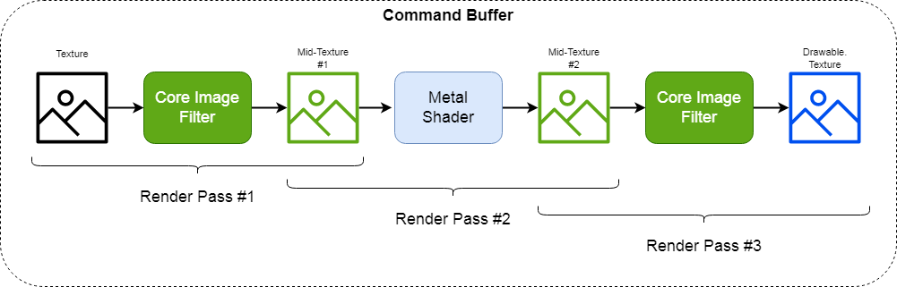
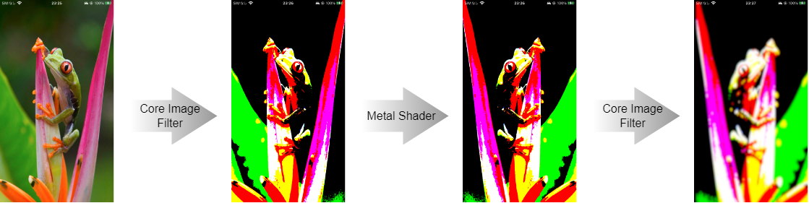

# MTL_CIF2MTL2CIFSample

Connect 3 render passes : Core Image Filter -> Metal  Shader -> Core Image Filter.

---
Note :
- It works only on the actual device.
- At the end of the code, an additional Metal Shader is run. This is to fit the image into MTKView.
---

